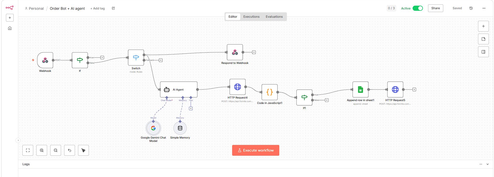
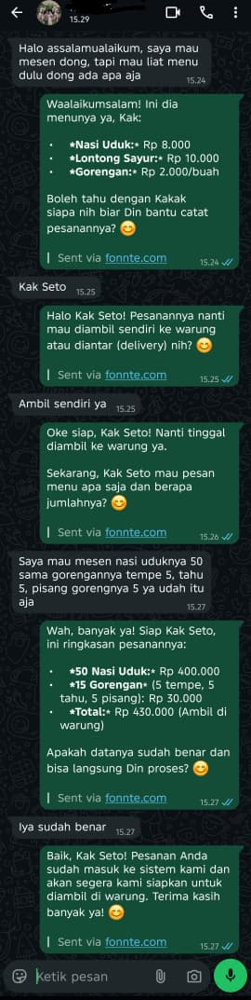
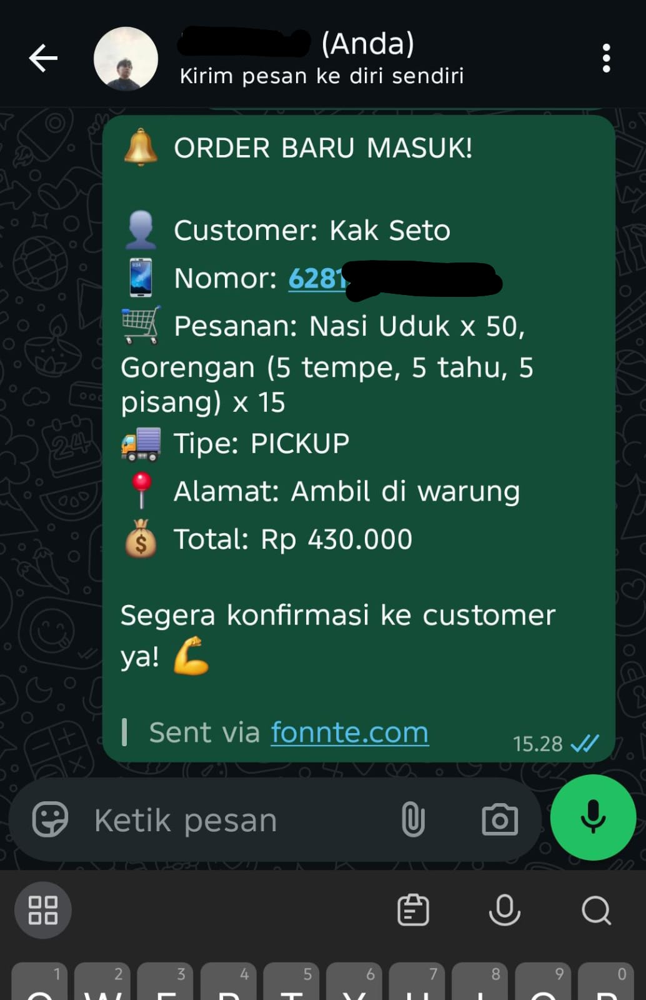
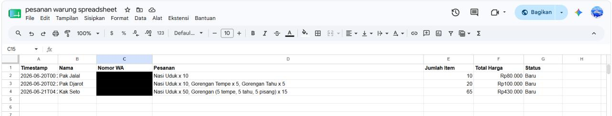
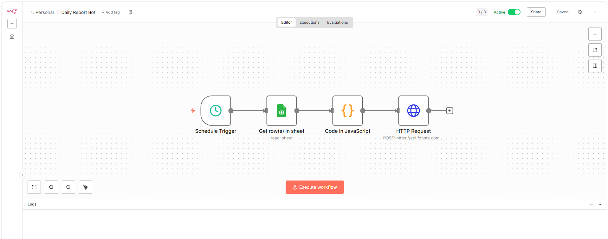
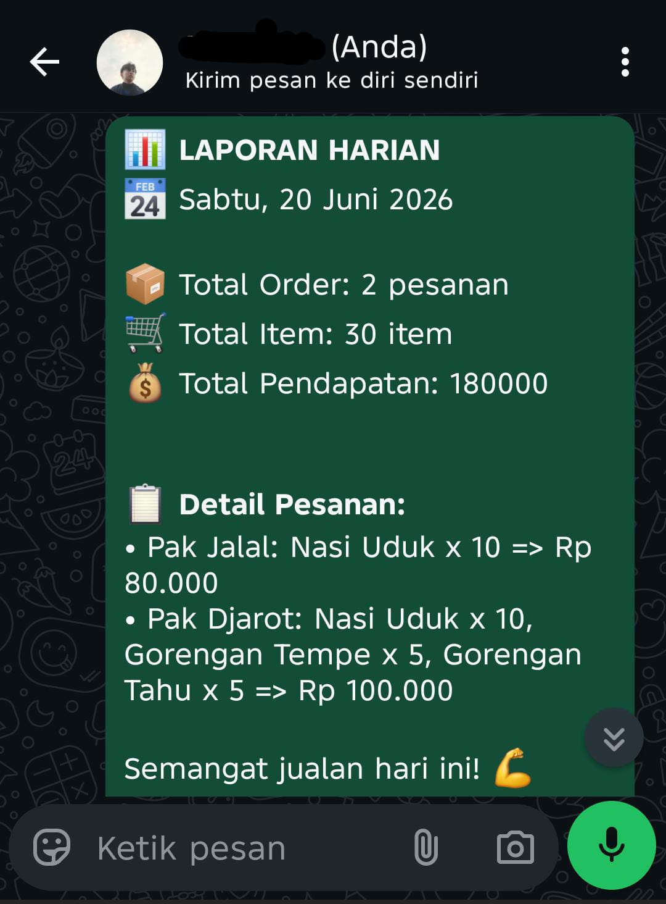
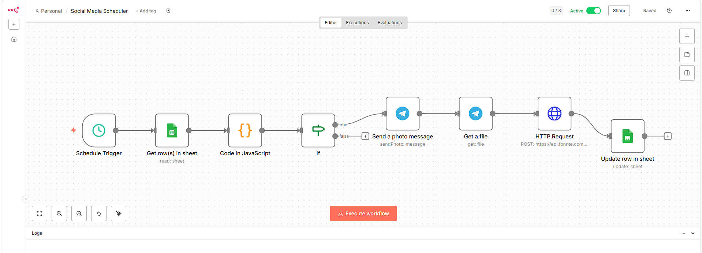
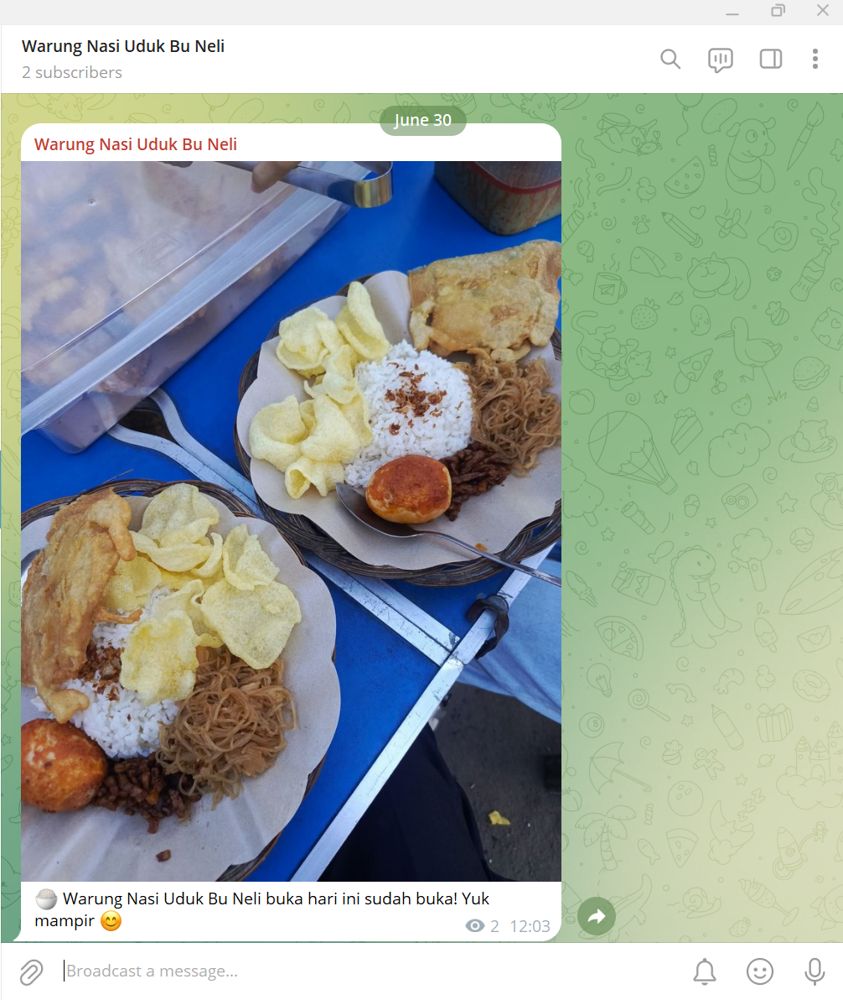
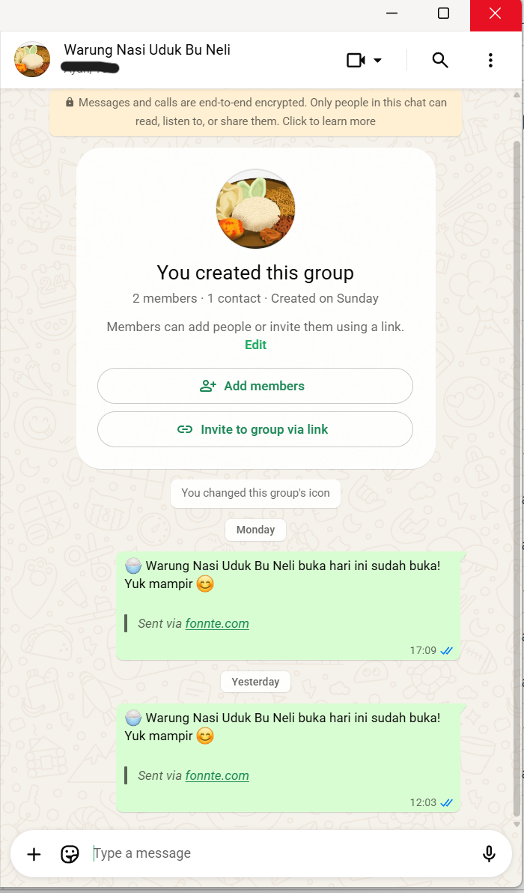
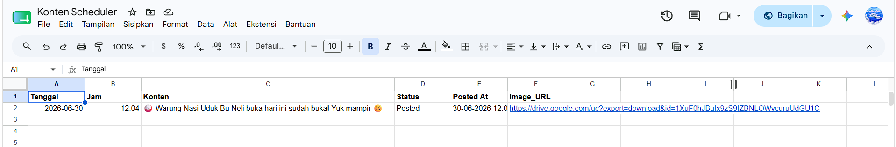

# 🍛 Warung Nasi Uduk Bu Neli — n8n Automation Portfolio

Kumpulan workflow otomasi bisnis berbasis **n8n** untuk studi kasus UMKM fiktif "Warung Nasi Uduk Bu Neli". Project ini dibangun sebagai portfolio untuk mendemonstrasikan kemampuan workflow automation, API integration, dan AI agent development.

---

## 📋 Daftar Workflow

| Workflow | Deskripsi | Status |
|---|---|---|
| [Order Bot + AI Agent](#1-order-bot--ai-agent) | WhatsApp bot berbasis AI untuk terima pesanan customer | ✅ Active |
| [Daily Report Bot](#2-daily-report-bot) | Laporan harian otomatis ke WhatsApp owner setiap pagi | ✅ Active |
| [Social Media Scheduler](#3-social-media-scheduler) | Auto-post konten promosi ke Telegram Channel + WA Group | ✅ Active |

---

## 🛠️ Tech Stack

- **n8n** — workflow automation platform (self-hosted di Railway)
- **Fonnte API** — WhatsApp gateway
- **Telegram Bot API** — channel broadcast
- **Google Gemini API** — AI language model
- **Google Sheets API** — database sederhana
- **Railway** — cloud deployment (24/7)
- **JavaScript** — custom logic di Code nodes

---

## 📁 Struktur Repo

```
warung-nasi-uduk-n8n-automation/
├── README.md
├── workflows/
│   ├── order-bot-ai-agent.json         # Level 1-3
│   ├── daily-report-bot.json           # Level 2
│   └── social-media-scheduler.json     # Level 4
└── screenshots/
    └── (dokumentasi visual workflow)
```

---

## Workflow Detail

### 1. Order Bot + AI Agent

**File:** `workflows/order-bot-ai-agent.json`

Bot WhatsApp otomatis yang menggabungkan rule-based routing dengan AI conversational agent untuk membantu customer memesan makanan secara natural.

#### Arsitektur

```
Webhook (Fonnte) 
  → If (anti-loop filter)
  → Switch (route berdasarkan keyword)
      ├── "menu"   → Edit Fields → HTTP Request (balas menu)
      ├── "pesan"  → Get Sheet (menu) → Code JS (hitung harga) 
      │              → Append Sheet → Notif Owner → Balas Customer
      └── fallback → AI Agent (Google Gemini)
                      → HTTP Request4 (kirim balasan AI)
                      → Code JS1 (parse ###ORDER### block)
                      → If1 (cek apakah ada order)
                          → Append Sheet + Notif Owner
```

#### Fitur Utama

- **Anti-loop filter** — node If mencegah bot membalas pesannya sendiri dengan membandingkan `sender` vs `device`
- **AI Conversational Agent** — Google Gemini dengan session memory berbasis nomor WA, mampu ngobrol natural dan kumpulkan data pesanan
- **Structured output parsing** — AI menghasilkan blok `###ORDER###` yang di-parse oleh Code node untuk ekstrak data terstruktur (nama, tipe delivery, alamat, total)
- **Dual pipeline** — keyword-based untuk respons cepat, AI untuk percakapan kompleks
- **Real-time notifikasi owner** — setiap order masuk langsung dikirim ke WA owner dengan detail lengkap

#### Key Technical Challenge

Implementasi **delimiter parsing** (`###ORDER###...###END###`) untuk mengekstrak data terstruktur dari output AI yang bersifat natural language — memungkinkan integrasi antara conversational AI dan database tanpa perlu function calling.

---

### 2. Daily Report Bot

**File:** `workflows/daily-report-bot.json`

Bot laporan otomatis yang berjalan setiap pagi jam 07.00 WIB, merangkum data penjualan hari sebelumnya dari Google Sheets dan mengirimkannya ke WhatsApp owner.

#### Arsitektur

```
Schedule Trigger (07:00 WIB daily)
  → Get Rows (Google Sheets - Sheet1)
  → Code JS (filter tanggal kemarin, hitung agregasi)
  → HTTP Request (kirim laporan via Fonnte)
```

#### Fitur Utama

- **Schedule-based trigger** — jalan otomatis tanpa intervensi manual
- **Date filtering** — filter data berdasarkan timestamp, hanya ambil order hari kemarin
- **Agregasi data** — hitung total order, total item, total pendapatan
- **Graceful empty state** — kalau tidak ada order, tetap kirim pesan motivasi ke owner

---

### 3. Social Media Scheduler

**File:** `workflows/social-media-scheduler.json`

Sistem penjadwalan konten otomatis yang membaca jadwal posting dari Google Sheets dan mendistribusikan konten ke Telegram Channel dan WhatsApp Group secara bersamaan.

#### Arsitektur

```
Schedule Trigger (setiap jam)
  → Get Rows (filter Status = "Pending")
  → Code JS (cek tanggal & jam sesuai jadwal)
  → If (skip jika belum waktunya)
      └── [true] Send Photo (Telegram Channel)
                  → Get File (download binary dari Telegram)
                  → HTTP Request (broadcast ke WA Group via Fonnte)
                  → Update Row (ubah Status → "Posted" + timestamp)
```

#### Fitur Utama

- **Google Sheets sebagai CMS** — tim bisa input konten di Sheets, sistem yang eksekusi otomatis
- **Multi-platform broadcast** — satu konten, dikirim ke Telegram Channel dan WhatsApp Group sekaligus
- **Binary file transfer** — gambar didownload dari Telegram sebagai binary lalu dikirim ulang ke Fonnte, menghindari masalah image hosting eksternal
- **Auto status tracking** — kolom Status otomatis update dari "Pending" → "Posted" beserta timestamp
- **Timezone-aware scheduling** — menggunakan `Asia/Jakarta` timezone untuk akurasi jadwal

#### Google Sheets Schema

| Kolom | Tipe | Deskripsi |
|---|---|---|
| Tanggal | Date (YYYY-MM-DD) | Tanggal posting |
| Jam | Time (HH:MM) | Jam posting |
| Konten | String | Caption/teks konten |
| Status | String | Pending / Posted |
| Posted At | String | Timestamp saat terposting |
| Image_URL | URL | Link gambar konten |

#### Technical Notes & Debugging Log

Proses development workflow ini melibatkan debugging API integration yang cukup kompleks:

**Masalah:** Fonnte Free plan tidak mendukung pengiriman attachment (gambar) ke WhatsApp Group — meskipun API selalu mengembalikan response `success: true`, gambar tidak pernah terkirim.

**Investigasi:**
1. Dicoba via URL parameter (`url`) dengan berbagai image hosting: Cloudinary (hotlink blocked), ImgBB (SSL error), Google Drive (redirect/auth layer) — semua gagal
2. Dicoba via binary file upload langsung (download dari Telegram → kirim ke Fonnte sebagai `formBinaryData`) — masih gagal dengan pola yang sama
3. Root cause ditemukan setelah cek halaman Order di dashboard Fonnte: fitur Attachment dicoret merah (tidak tersedia) bahkan di paket Regular, bukan hanya Free

**Kesimpulan:** Limitasi ini bukan bug teknis melainkan kebijakan bisnis Fonnte. Solusi: upgrade ke paket yang mendukung attachment, atau gunakan WhatsApp Group hanya untuk text broadcast sementara Telegram Channel menjadi platform utama untuk konten visual.

**Lesson learned:** Selalu cek feature matrix paket API pihak ketiga sebelum mulai development, terutama untuk fitur yang bersifat premium (attachment, bulk messaging, dll).

---

## 📸 Screenshots

### Order Bot + AI Agent





### Daily Report Bot



### Social Media Scheduler





## ⚙️ Setup & Konfigurasi

### Prerequisites

- n8n instance (self-hosted atau cloud)
- Akun Fonnte dengan device WhatsApp terhubung
- Telegram Bot Token
- Google Cloud project dengan Sheets API enabled
- Google Gemini API key (untuk workflow AI Agent)

### Cara Import Workflow

1. Buka n8n → **Workflows** → **Import from file**
2. Pilih file JSON dari folder `workflows/`
3. Konfigurasi credentials:
   - Ganti semua `YOUR_FONNTE_TOKEN_HERE` dengan token Fonnte kamu
   - Ganti semua `YOUR_GOOGLE_SHEETS_URL_HERE` dengan URL spreadsheet kamu
   - Ganti `YOUR_OWNER_WHATSAPP_NUMBER_HERE` dengan nomor WA owner (format: `628xxxxxxxxxx`)
   - Setup Google Sheets OAuth2 credential di n8n
   - Setup Telegram credential di n8n
   - Setup Google Gemini credential di n8n (untuk Order Bot)

### Environment

Workflow ini di-deploy di **Railway** menggunakan n8n Docker image dengan konfigurasi:
- Timezone: `Asia/Jakarta`
- Webhook URL: dikonfigurasi di Fonnte sebagai endpoint penerima pesan WA

---

## 👤 Author

**M Naufal Awalludin**  
Informatics Engineering Student @ Universitas Indraprasta PGRI (UNINDRA)  
[LinkedIn](https://www.linkedin.com/in/m-naufal-awalludin-0736b3309/) · [GitHub](https://github.com/mnaufal-a)

---

## 📄 License

Project ini dibuat untuk keperluan portfolio dan pembelajaran. Bebas digunakan sebagai referensi dengan mencantumkan kredit.
